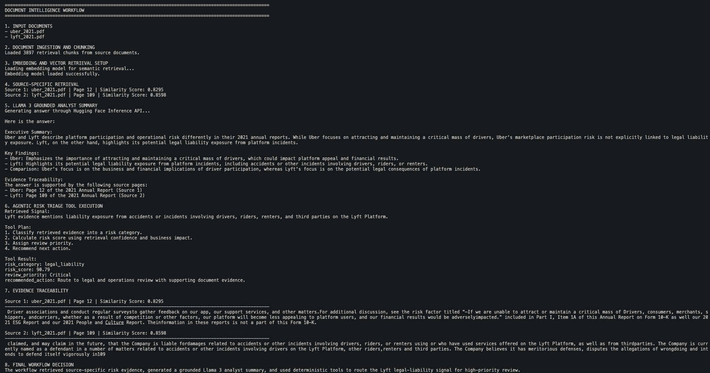
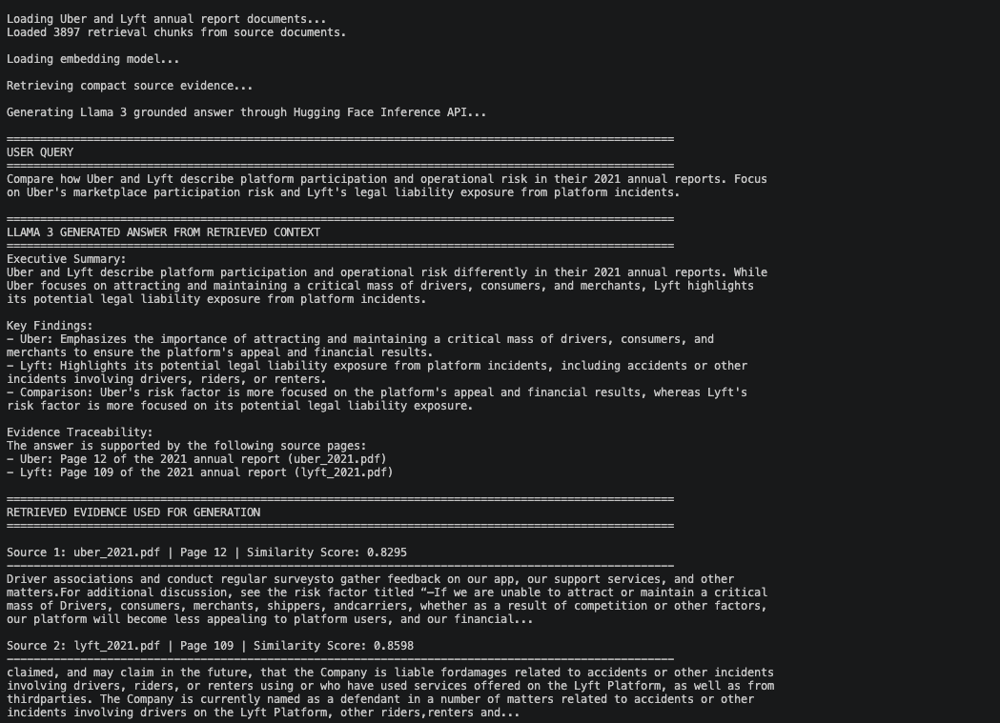
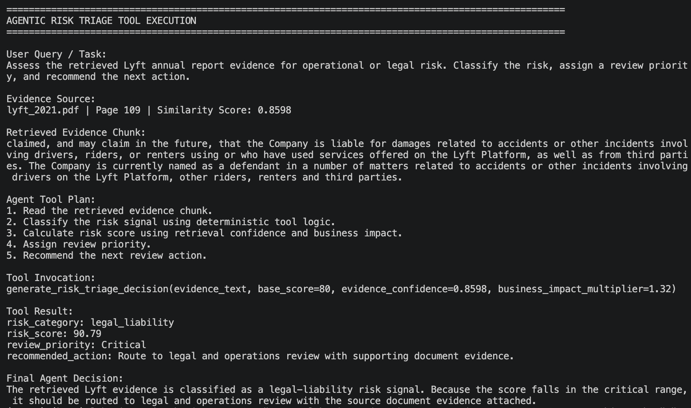

# GenAI Document Intelligence Assistant

A document intelligence system that uses RAG, vector search, LlamaIndex/LangChain workflows, Llama 3, Phi-3 experimentation, and deterministic tool execution to search, compare, and reason over unstructured documents.

The project demonstrates a retrieval-first GenAI workflow:

```text
Documents -> chunks -> embeddings -> vector retrieval -> grounded LLM answer -> deterministic tool execution -> evidence traceability
```

For demonstration, the project uses public annual reports as sample documents. The same workflow can be adapted to policies, compliance documents, financial reports, SOPs, legal files, HR manuals, insurance documents, and internal knowledge bases.

---

## Why I Built This

Important information is often buried inside long PDFs, reports, manuals, and internal documents. Keyword search can help, but it does not always retrieve the right context or connect related information across files.

I built this project to demonstrate how a document assistant can retrieve relevant evidence first, then generate a grounded answer from that context.

The project also includes a deterministic tool layer for structured decisions. The LLM handles summarization from retrieved context, while Python tools handle risk classification, scoring, priority assignment, and recommended action.

---

## What This Project Includes

### Multi-document retrieval

The system processes multiple PDF/text documents, splits them into chunks, creates embeddings, and retrieves relevant sections for a user query.

The outputs include source document names, page numbers, similarity scores, and evidence snippets.

### Grounded Llama 3 answer generation

The focused Llama 3 workflow retrieves compact source evidence and sends only that context to Llama 3 through Hugging Face Inference API.

This keeps the answer grounded in retrieved documents instead of relying on open-ended generation.

### LlamaIndex workflow

The LlamaIndex implementation creates document-specific query engines and exposes them through a tool-based interface. This supports targeted retrieval when different documents represent different knowledge sources.

### LangChain / Phi-3 workflow

The repository includes a LangChain + Phi-3 Mini path with ChromaDB experimentation. This serves as the local LLM and persisted vector-store implementation path.

### Deterministic risk triage

The risk triage workflow passes retrieved evidence into Python tools that classify the signal, calculate a confidence-weighted score, assign priority, and recommend the next action.

This avoids asking the LLM to generate operational scores or routing decisions without deterministic logic.

---

## Repository Structure

| Path | Purpose |
|---|---|
| `src/run_document_risk_intelligence_demo.py` | Main end-to-end workflow combining retrieval, Llama 3 response generation, tool execution, and evidence traceability |
| `src/run_llama3_grounded_rag.py` | Focused Llama 3 grounded RAG workflow |
| `src/rag_agent_tools.py` | Deterministic tools for risk classification, scoring, priority assignment, and action recommendation |
| `src/run_rag_demo.py` | Lightweight custom retrieval demo using embeddings and cosine similarity |
| `src/rag_llamaindex.py` | LlamaIndex-based document retrieval workflow |
| `src/llm_init.py` | LLM initialization and Hugging Face token handling |
| `src/llm_tasks.py` | Shared helper functions for LLM and retrieval tasks |
| `src/rag_phi3_langchain.py` | LangChain + Phi-3 local RAG workflow |
| `src/rag_phi3_demo.py` | Demo runner for the Phi-3 workflow |
| `sample_docs/` | Sample documents used for retrieval workflows |
| `outputs/` | Screenshots of successful workflow runs |

---

## Output Examples

### Document intelligence workflow

End-to-end workflow covering document ingestion, chunking, embedding-based retrieval, Llama 3 answer generation, deterministic risk triage, source pages, similarity scores, and final decision.



---

### Grounded Llama 3 RAG answer

Focused RAG output showing the user query, Llama 3 response, retrieved evidence, source documents, page numbers, and similarity scores.



---

### Deterministic risk triage

Tool-execution output where retrieved evidence is passed into Python functions that return risk category, score, priority, recommended action, and final decision.



---

## Architecture

```text
User Query
   ↓
Document Loader
   ↓
Chunking
   ↓
Embedding Model
   ↓
Vector Retrieval
   ↓
Retrieved Source Context
   ↓
Grounded LLM Response
   ↓
Deterministic Tool Execution
   ↓
Evidence Traceability + Final Decision
```

---

## Tech Stack

- Python
- Llama 3
- Hugging Face Inference API
- SentenceTransformers
- LlamaIndex
- LangChain
- ChromaDB
- Microsoft Phi-3 Mini
- PDF parsing
- Vector similarity search
- Deterministic Python tools

---

## Setup

Clone the repository:

```bash
git clone https://github.com/MahendraMurari/genai_document_intelligence_assistant.git
cd genai_document_intelligence_assistant
```

Create and activate a virtual environment:

```bash
python3 -m venv .venv
source .venv/bin/activate
```

Install dependencies:

```bash
pip install -r requirements.txt
```

Create a local environment file:

```bash
cp .env.example .env
```

Add your Hugging Face token locally:

```text
HF_TOKEN=your_huggingface_token_here
```

Do not commit `.env` to GitHub.

---

## Running the Project

Run the main document intelligence workflow:

```bash
python src/run_document_risk_intelligence_demo.py
```

Run the focused Llama 3 grounded RAG workflow:

```bash
python src/run_llama3_grounded_rag.py
```

Run the deterministic risk triage workflow:

```bash
python src/rag_agent_tools.py
```

Run the optional Phi-3 LangChain workflow:

```bash
python src/rag_phi3_demo.py
```

---

## Notes

The main demo uses local PDF parsing, embedding generation, and in-memory vector similarity search. Llama 3 generation is handled through Hugging Face Inference API.

The LangChain/Phi-3 path includes ChromaDB-based vector-store experimentation.

Generated vector indexes, local cache files, and secrets are intentionally excluded from the repository.

Before pushing, check that no real Hugging Face token is present:

```bash
grep -R "hf_" .
```

Only `.env.example` should include:

```text
HF_TOKEN=your_huggingface_token_here
```

---

## What This Project Demonstrates

- retrieval-first document processing
- multi-document semantic search
- grounded LLM generation from retrieved evidence
- source document, page, and similarity-score traceability
- deterministic tool execution for structured decisions
- secure token handling through environment variables
- local LLM and vector-store experimentation through Phi-3 and ChromaDB
