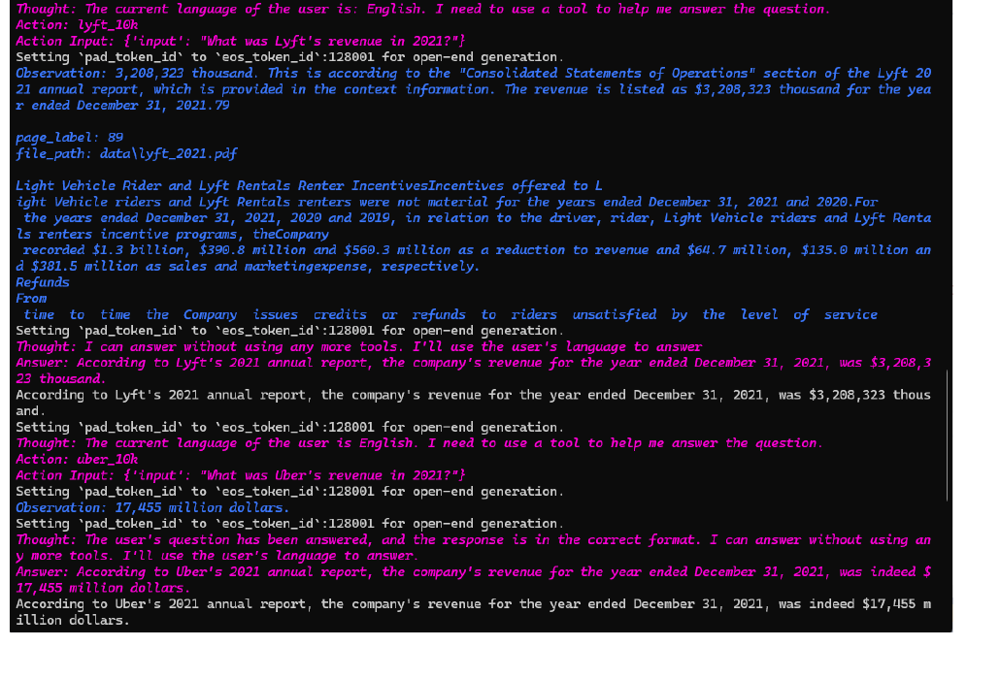
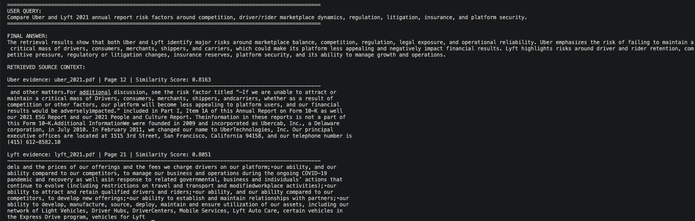

# GenAI Document Intelligence Assistant

A document intelligence system that uses Retrieval Augmented Generation, vector search, local LLM workflows, and agent-style tool execution to search, compare, and reason over unstructured documents.

The project focuses on a practical GenAI pattern: taking large PDF/text sources, converting them into searchable knowledge, retrieving the most relevant context, and producing evidence-backed answers with source references.

## Why I Built This

A common problem in enterprise AI is that useful information is buried inside long documents such as reports, policies, manuals, internal knowledge files, and operational references.

A normal keyword search can find matching words, but it does not always understand the question or connect related context across documents. This project explores how a retrieval-based assistant can improve that workflow by combining semantic search, document chunking, vector indexes, LLMs, and tool-use patterns.

The goal is not just to generate an answer. The goal is to make the answer traceable through retrieved source context, document names, page references, and similarity scoring.

## What This Project Demonstrates

This repository includes three connected workflows:

### 1. Multi-document RAG over business reports

The system loads annual report PDFs, splits them into chunks, embeds the text, and retrieves the most relevant sections for a user query.

The main example compares business risk factors across Uber and Lyft annual reports. The output shows the query, final answer, source document names, page references, and similarity scores.

### 2. LlamaIndex-based document retrieval

The LlamaIndex workflow creates document-specific query engines and exposes them as tools. This makes it possible to route questions to the right document source and retrieve targeted context from each report.

This part is useful for multi-document question answering where different files represent different knowledge sources.

### 3. Agentic tool-use workflow

The project also includes a ReAct-style tool execution flow. Instead of only generating text, the assistant can call helper functions, observe intermediate results, and continue reasoning before returning a final answer.

The included tools cover arithmetic and utility operations such as addition, subtraction, multiplication, division, and circle-area calculation. This demonstrates the same core idea used in larger agentic systems: controlled tool access with intermediate observations.

## Repository Structure

```text
genai_document_intelligence_assistant/
│
├── src/
│   ├── llm_init.py
│   ├── llm_tasks.py
│   ├── rag_llamaindex.py
│   ├── rag_math_tools.py
│   ├── rag_phi3_langchain.py
│   └── rag_phi3_demo.py
│
├── sample_docs/
│   ├── uber_2021.pdf
│   ├── lyft_2021.pdf
│   └── MSAI.txt
│
├── outputs/
│   ├── multi_document_rag_financial_reports.png
│   ├── multi_document_risk_comparison.png
│   └── agentic_tool_use_math_tools.png
│
├── requirements.txt
├── .env.example
├── .gitignore
└── README.md
```

## Core Components

### `llm_init.py`

Initializes a Hugging Face-hosted Llama model for LlamaIndex workflows.

The Hugging Face token is loaded through an environment variable instead of being hardcoded in the source code.

```python
hf_token = os.getenv("HF_TOKEN")
```

This keeps credentials out of GitHub while still supporting local model execution.

### `llm_tasks.py`

Contains reusable LLM and RAG helper functions, including:

- direct completion
- chat-style response generation
- document loading
- embedding model setup
- vector index creation
- simple document-based retrieval

This file acts as a shared utility layer for LLM and retrieval workflows.

### `rag_llamaindex.py`

Implements the LlamaIndex-based RAG workflow.

It creates document query engines for business report PDFs and connects them to tool-style interfaces. This allows the assistant to retrieve from specific documents and answer questions using document-grounded context.

This is the strongest workflow in the repo for multi-document document intelligence.

### `rag_math_tools.py`

Defines helper functions used by the agentic workflow.

The tool set includes:

- `add`
- `subtract`
- `multiply`
- `divide`
- `compute_circle_area`

These functions are used to demonstrate a basic tool-calling workflow where the model chooses a tool, passes inputs, observes the output, and continues toward a final answer.

### `rag_phi3_langchain.py` and `rag_phi3_demo.py`

These files explore a LangChain-based RAG path with Microsoft Phi-3 Mini.

The workflow covers:

- local model loading
- PDF loading
- chunking with recursive text splitting
- Hugging Face embeddings
- Chroma vector storage
- retrieved-context question answering

Phi-3 can be slower in CPU-only environments, so the main output screenshots focus on the cleaner LlamaIndex retrieval workflow. The Phi-3 path is kept as an implementation branch for local LLM experimentation.

## Architecture

### Retrieval Workflow

```text
User Query
   ↓
Document Loader
   ↓
Text Chunking
   ↓
Embedding Model
   ↓
Vector Index
   ↓
Semantic Retrieval
   ↓
Relevant Source Context
   ↓
LLM / Response Layer
   ↓
Grounded Answer
```

### Agent Tool-Use Workflow

```text
User Query
   ↓
Agent Reasoning Step
   ↓
Tool Selection
   ↓
Function Execution
   ↓
Observation
   ↓
Follow-up Reasoning
   ↓
Final Answer
```

## Output Examples

### Multi-document RAG over financial reports

This output shows document retrieval across business report PDFs using document-specific query tools.



### Risk comparison with source grounding

This output shows a cleaner custom retrieval run over Uber and Lyft annual reports. It includes the user query, final answer, retrieved source documents, page references, and similarity scores.



### Agentic tool-use example

This output shows the assistant using helper functions through a ReAct-style workflow before returning the final result.


## Tech Stack

- Python
- LlamaIndex
- LangChain
- Hugging Face Transformers
- Hugging Face Embeddings
- Microsoft Phi-3 Mini
- Llama 3 integration pattern
- ChromaDB
- Vector search
- ReAct-style agents
- PDF processing
- Semantic similarity retrieval

## Setup

Clone the repository:

```bash
git clone https://github.com/MahendraMurari/genai_document_intelligence_assistant.git
cd genai_document_intelligence_assistant
```

Create and activate a virtual environment:

```bash
python3 -m venv .venv
source .venv/bin/activate
```

Install dependencies:

```bash
pip install -r requirements.txt
```

Create a local environment file:

```bash
cp .env.example .env
```

Add your Hugging Face token locally:

```text
HF_TOKEN=your_huggingface_token_here
```

Do not commit `.env` to GitHub.

## Running the Project

Run the LlamaIndex RAG workflow:

```bash
python src/rag_llamaindex.py
```

Run the Phi-3 LangChain workflow:

```bash
python src/rag_phi3_demo.py
```

The generated vector indexes are local runtime artifacts and are intentionally excluded from the repository.

## Repository Hygiene

The repository avoids committing secrets, generated indexes, local cache files, or IDE-specific files.

Ignored examples include:

```text
.env
__pycache__/
*.pyc
mydb_index/
new_db_index/
*.user
*.sln
*.pyproj
.vs/
```

## What This Project Shows

This project demonstrates how document intelligence systems can be built around retrieval-first design.

The important parts are:

- converting long documents into searchable chunks
- using embeddings for semantic retrieval
- grounding answers in source context
- comparing information across multiple documents
- exposing document query engines as tools
- using helper functions in an agent-style workflow
- keeping secrets and generated artifacts out of source control

The result is a practical GenAI workflow that is inspectable, modular, and closer to how real document assistants are built.
